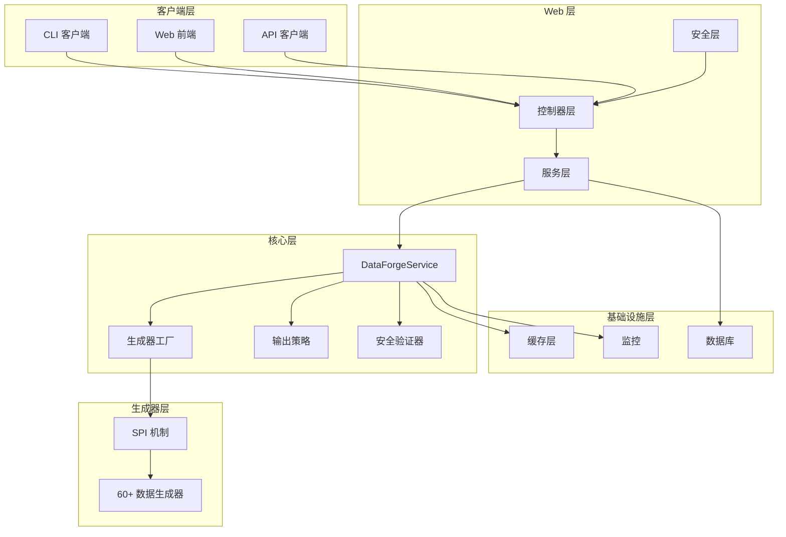
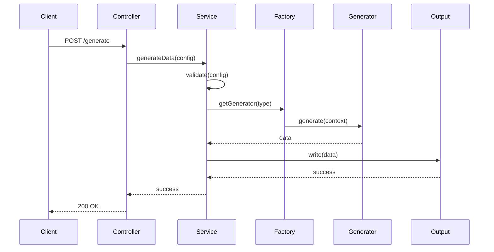
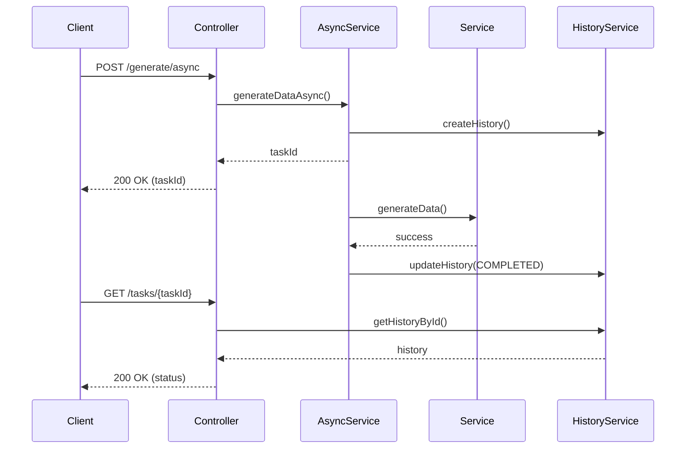

# DataForge 架构文档

## 系统概述

DataForge 是一个高性能、灵活且高度可配置的测试数据生成工具，采用 Spring Boot 3.2+ 构建，支持 60+ 种数据生成器。

## 架构图



## 模块结构

### data-forge-core

核心模块，包含数据生成引擎和所有生成器。

**主要组件**:
- `DataForgeService`: 核心服务，协调数据生成流程
- `GeneratorFactory`: 生成器工厂，使用 SPI 机制动态加载生成器
- `OutputStrategy`: 输出策略接口，支持 CSV、JSON、SQL、Console 等
- `SecurityValidator`: 安全验证器，防止资源滥用
- `CacheManager`: 缓存管理器，提高生成性能

**包结构**:
```
com.dataforge
├── config/          # 配置类
├── core/            # 核心引擎
├── generators/      # 数据生成器（60+）
├── io/              # 输出策略
├── service/         # 服务层
├── validation/      # 验证器
└── monitoring/      # 监控
```

### data-forge-web

Web API 模块，提供 RESTful API。

**主要组件**:
- `DataForgeController`: 数据生成控制器
- `TemplateController`: 模板管理控制器
- `AuthController`: 认证控制器
- `HealthCheckController`: 健康检查控制器
- `AsyncDataGenerationService`: 异步数据生成服务
- `MetricsService`: 指标收集服务

**包结构**:
```
com.dataforge.web
├── controller/      # REST 控制器
├── service/         # 业务服务
├── repository/      # 数据访问
├── entity/          # 实体类
├── model/           # DTO 模型
├── security/       # 安全配置
├── config/          # 配置类
└── filter/          # 过滤器
```

### data-forge-cli

命令行接口模块，使用 Picocli 构建。

## 核心设计模式

### 1. SPI (Service Provider Interface)

生成器使用 Java SPI 机制动态加载：

```java
ServiceLoader<DataGenerator> loader = ServiceLoader.load(DataGenerator.class);
```

**优势**:
- 支持插件式扩展
- 运行时发现生成器
- 无需修改核心代码即可添加新生成器

### 2. 策略模式

输出策略使用策略模式：

```java
interface OutputStrategy {
    void write(List<Map<String, Object>> data);
}
```

**实现**:
- `CsvOutputStrategy`
- `JsonOutputStrategy`
- `SqlOutputStrategy`
- `ConsoleOutputStrategy`

### 3. 工厂模式

`GeneratorFactory` 负责创建和管理生成器实例：

```java
DataGenerator<?, ?> generator = factory.getGenerator(type);
```

### 4. 模板方法模式

数据生成流程使用模板方法：

```java
public void generateData(ForgeConfig config) {
    validate(config);
    prepareOutput(config);
    generateRecords(config);
    finishOutput(config);
}
```

## 数据流

### 同步生成流程



### 异步生成流程



## 安全架构

### 认证与授权

- **JWT 认证**: 使用 JWT 令牌进行无状态认证
- **Spring Security**: 集成 Spring Security 提供安全框架
- **角色控制**: 支持基于角色的访问控制（RBAC）

### 安全措施

1. **输入验证**: 所有输入都经过严格验证
2. **资源限制**: 限制记录数、线程数、字段数等
3. **API 限流**: 基于 Redis 的分布式限流
4. **安全响应头**: HSTS、CSP、XSS Protection 等
5. **依赖扫描**: OWASP Dependency Check 自动扫描漏洞

## 性能优化

### 缓存策略

- **生成器缓存**: 缓存生成器实例，避免重复创建
- **多级缓存**: Caffeine (本地) + Redis (分布式)
- **缓存预热**: 启动时预加载常用生成器

### 并发处理

- **线程池**: 可配置的线程池大小
- **分批处理**: 大数据量分批生成，避免内存溢出
- **流式输出**: 使用 StreamingResponseBody 实现流式响应

### 性能指标

- **生成速度**: 支持每秒生成数万条记录
- **内存使用**: 流式处理，内存占用稳定
- **响应时间**: P95 响应时间 < 100ms

## 监控与可观测性

### 指标收集

使用 Micrometer 收集指标：

- `dataforge.generation.count`: 生成请求总数
- `dataforge.generation.success`: 成功次数
- `dataforge.generation.failure`: 失败次数
- `dataforge.generation.duration`: 生成耗时
- `dataforge.records.generated`: 生成记录数

### 健康检查

- **Spring Actuator**: 提供标准健康检查端点
- **自定义健康指示器**: 检查生成器、Redis、数据库状态
- **详细健康信息**: 内存、线程、缓存状态

### 日志追踪

- **请求ID**: 每个请求分配唯一ID
- **MDC**: 使用 MDC 实现日志关联
- **结构化日志**: JSON 格式日志，便于分析

## 扩展性

### 添加新生成器

1. 实现 `DataGenerator<T, C extends FieldConfig>` 接口
2. 创建配置类继承 `FieldConfig`
3. 在 `META-INF/services/com.dataforge.generators.spi.DataGenerator` 中注册
4. 添加单元测试

### 添加新输出格式

1. 实现 `OutputStrategy` 接口
2. 注册为 Spring Bean
3. 在 `OutputConfig.Format` 枚举中添加新格式

## 部署架构

### 容器化部署

```dockerfile
FROM openjdk:21-jre-slim
COPY target/data-forge-web-*.jar app.jar
ENTRYPOINT ["java", "-jar", "app.jar"]
```

### Kubernetes 部署

- **Deployment**: 应用部署
- **Service**: 服务暴露
- **ConfigMap**: 配置管理
- **Secret**: 敏感信息管理
- **HPA**: 水平自动扩缩容

## 技术栈

- **框架**: Spring Boot 3.2.1
- **语言**: Java 21
- **构建工具**: Maven 3.6+
- **数据库**: H2 (开发), MySQL (生产)
- **缓存**: Caffeine, Redis
- **安全**: Spring Security, JWT
- **监控**: Micrometer, Prometheus
- **文档**: SpringDoc OpenAPI

## 未来规划

1. **分布式生成**: 支持多节点分布式数据生成
2. **实时流式生成**: 支持 Kafka 等消息队列
3. **数据质量检查**: 集成数据质量检查工具
4. **可视化配置**: Web UI 可视化配置生成规则
5. **AI 辅助**: 使用 AI 生成更真实的数据
